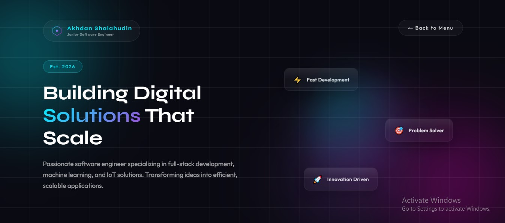

# 🚀 Akhdan Shalahudin - Portfolio Website

A modern, interactive portfolio website showcasing my work as a Junior Software Engineer. Built with clean HTML, CSS, and JavaScript featuring smooth animations and a unique grid-based navigation system.



## ✨ Features

- 🎨 **Modern UI/UX Design** - Futuristic design with gradient effects and smooth animations
- 📱 **Fully Responsive** - Works seamlessly on desktop, tablet, and mobile devices
- 🎯 **Interactive Navigation** - Unique grid-based menu system with smooth transitions
- 📧 **Contact Form** - Integrated with EmailJS for direct messaging
- 🎭 **Sections Include**:
  - Home/Introduction
  - Projects Portfolio
  - Certifications
  - Work Experience
  - About Me
  - Education
  - Community Involvement
  - Awards & Recognition
  - Contact Form

## 🛠️ Technologies Used

- HTML5
- CSS3 (with CSS Grid & Flexbox)
- Vanilla JavaScript
- EmailJS (for contact form)
- Google Fonts (Outfit & Syne)

## 📦 Installation

### Clone the repository

```bash
git clone https://github.com/akhdansh1/portfolio-website.git
cd portfolio-website
```

### File Structure

```
portfolio-website/
├── index.html
├── templatemo-nexaverse.css
├── templatemo-nexa-scripts.js
├── images/
│   └── akhdan.jpg
└── README.md
```

### Setup EmailJS

1. Go to [EmailJS](https://www.emailjs.com/)
2. Create an account and get your credentials
3. Update the EmailJS configuration in `index.html`:

```javascript
emailjs.init("YOUR_PUBLIC_KEY");
```

4. Update Service ID and Template ID in `templatemo-nexa-scripts.js`:

```javascript
emailjs.sendForm("YOUR_SERVICE_ID", "YOUR_TEMPLATE_ID", this);
```

## 🚀 Deployment

### Option 1: GitHub Pages

1. **Push to GitHub:**

```bash
git init
git add .
git commit -m "Initial commit"
git branch -M main
git remote add origin https://github.com/akhdansh1/portfolio-website.git
git push -u origin main
```

2. **Enable GitHub Pages:**
   - Go to your repository on GitHub
   - Click on **Settings**
   - Scroll to **Pages** section
   - Under **Source**, select `main` branch
   - Click **Save**
   - Your site will be live at: `https://akhdansh1.github.io/portfolio-website/`

### Option 2: Netlify

1. **Via Netlify Website:**
   - Go to [Netlify](https://www.netlify.com/)
   - Sign up/Login
   - Click "Add new site" → "Import an existing project"
   - Connect your GitHub repository
   - Deploy!

2. **Via Netlify CLI:**

```bash
npm install -g netlify-cli
netlify login
netlify init
netlify deploy --prod
```

### Option 3: Vercel

1. **Via Vercel Website:**
   - Go to [Vercel](https://vercel.com/)
   - Sign up/Login with GitHub
   - Click "New Project"
   - Import your repository
   - Deploy!

2. **Via Vercel CLI:**

```bash
npm install -g vercel
vercel login
vercel --prod
```

### Option 4: Firebase Hosting

```bash
# Install Firebase CLI
npm install -g firebase-tools

# Login to Firebase
firebase login

# Initialize Firebase
firebase init hosting

# Deploy
firebase deploy
```

## 📝 Configuration

### Update Personal Information

Edit `index.html` to update:

- Name and title
- Project links and descriptions
- Certification links
- Work experience details
- Contact information
- Social media links

### Customize Styling

Edit `templatemo-nexaverse.css` to customize:

- Color scheme (gradients)
- Typography
- Animations
- Layout spacing

## 📧 Contact Form Setup

The contact form uses EmailJS. Make sure to:

1. Create an EmailJS account
2. Create an email service
3. Create an email template with these variables:
   - `{{from_name}}`
   - `{{reply_to}}`
   - `{{subject}}`
   - `{{message}}`
4. Update credentials in the code

## 🎨 Customization Tips

### Change Color Scheme

Find and replace gradient colors in CSS:

```css
/* Current: Cyan to Magenta */
--gradient-start: #00f0ff;
--gradient-end: #ff00d4;

/* Example: Blue to Purple */
--gradient-start: #667eea;
--gradient-end: #764ba2;
```

### Add New Sections

1. Add menu item in HTML
2. Create content section
3. Add corresponding CSS styling
4. Update JavaScript navigation

## 📱 Browser Support

- Chrome (recommended)
- Firefox
- Safari
- Edge
- Opera

## 🐛 Known Issues

- None currently reported

## 📄 License

This project is open source and available under the [MIT License](LICENSE).

## 👤 Author

**Akhdan Shalahudin**

- GitHub: [@akhdansh1](https://github.com/akhdansh1)
- LinkedIn: [akhdan-shalahudin](https://www.linkedin.com/in/akhdan-shalahudin-12232b271)
- Email: akhdanshalahudin@gmail.com

## 🙏 Acknowledgments

- Template inspiration: TemplateMo 603 Nexaverse
- Icons: SVG inline graphics
- Fonts: Google Fonts (Outfit & Syne)
- Email service: EmailJS

## 📊 Project Status

🟢 Active - Maintained and updated regularly

---

**⭐ If you like this project, please give it a star!**

Made with ❤️ by Akhdan Shalahudin
